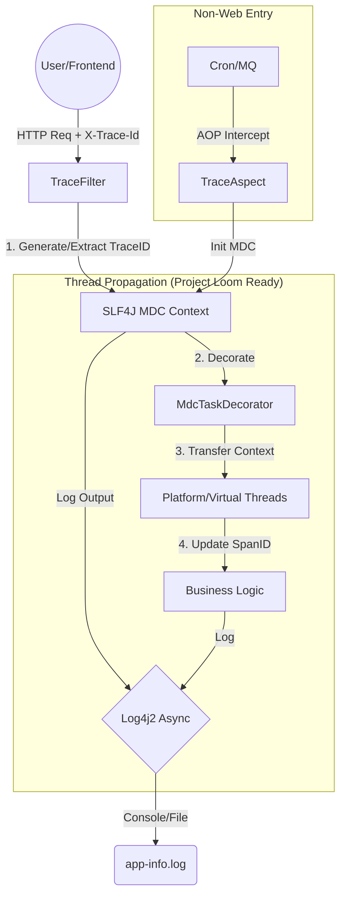

# 🚀 生产级全链路日志追踪改造方案 (High-Performance Distributed Tracing)

## 1. 方案概述

本方案旨在构建一套轻量级、高性能的日志追踪体系，核心目标是*
*让同一个请求在分布式系统、多线程（含虚拟线程）流转过程中的所有日志，都能通过唯一的 `TraceID` 串联起来**。
*虚拟线程不限制并发数,但是下游组件承压能力存在极限,需要在业务层或 AOP 层通过 Resilience4j 或 Guava Semaphore
来保护下游,此处暂不处理,主分支会有解决方案,请自行借鉴或按照您的经验处理。*
*由于本分支是主分支演进过程的中间产物，所以部分功能待完善，若要使用本分支的功能，请自行搜索 todo (共有三个)进行处理。*

### 核心架构图



---

## 2. 核心组件设计与实现

### 2.1 基础设施层 (Infrastructure)

**目标**：管理 TraceID 的生成、存储与清理，统一常量定义。

* **位置**：`common-observability` / `common-core`
* **关键类**：`TraceUtil`, `TraceConstant`

#### ✅ 核心逻辑 (`TraceUtil`)

1. **Start**: 优先使用传入的 ID（透传），若无则生成 Snowflake/UUID。
2. **Context Propagation**: 在主线程 `getCopyOfContextMap`，在子线程 `setContextMap`。
3. **Span 衍生**:
    * 父线程 `SpanID` 为 `main`。
    * 子线程自动生成 `sub-{id}`。
    * **创新点**：根据线程类型（`Thread.isVirtual()`）自动标记 `v-async` (虚拟线程) 或 `p-async` (平台线程)，极大辅助排查并发问题。

---

### 2.2 Web 接入层 (Web Layer)

**目标**：拦截 HTTP 请求，建立追踪起点，并响应 TraceID 给前端。

* **位置**：`common-web`
* **关键类**：`TraceFilter`, `WebTraceConfig`

#### ✅ 改造要点

1. **优先级最高**：设置 `Order` 为 `Integer.MIN_VALUE`，确保在 Spring Security 或其他 Filter 之前执行。
2. **双向透传**：
    * **入参**：检查 Header `X-Trace-Id`（微服务调用）。
    * **出参**：将最终的 `TraceID` 写入 Response Header（方便前端/测试定位问题）。
3. **强制清理**：在 `finally` 块中调用 `TraceUtil.end()`，防止线程池复用导致的**日志串号**（ThreadLocal 污染）。

---

### 2.3 异步并发层 (Concurrency Layer)

**目标**：解决“主线程 -> 子线程”时 `ThreadLocal` 丢失的问题。这是本方案针对 **Java 25** 的最大亮点。

* **位置**：`common-framework`
* **关键类**：`MdcTaskDecorator`, `AsyncConfig`

#### ✅ 改造要点

1. **装饰器模式 (`MdcTaskDecorator`)**：
    * 实现 Spring 的 `TaskDecorator` 接口。
    * **闭包捕获**：在调用者线程（父）捕获 MDC Map。
    * **上下文注入**：在执行者线程（子）恢复 MDC Map，并更新 `SpanID`。
2. **双线程池适配**：
    * **`ptExecutor` (Platform)**: CPU 密集型任务，挂载装饰器。
    * **`vtExecutor` (Virtual)**: IO 密集型任务，同样挂载装饰器。**虚拟线程也需要 MDC 传递！**

---

### 2.4 非 Web 入口层 (AOP Layer)

**目标**：覆盖定时任务、MQ 消费者等没有 HTTP 请求的场景。

* **位置**：`common-framework`
* **关键类**：`TraceAspect`, `AopTraceConfig`

#### ✅ 改造要点

1. **切点定义**：统一拦截 `@Scheduled`, `@KafkaListener`, `@RabbitListener`, `@XxlJob`。
2. **智能判断**：
    * 如果当前线程已有 TraceID（比如在 Service 层调用），则**不**重新生成。
    * 如果当前无 TraceID（新的触发源），则生成并负责清理。
3. **注意**：当实际场景设计到时再行测试与完善。

---

## 3. 日志输出层配置 (Log4j2)

**目标**：将内存中的 MDC 变量格式化输出到文件或控制台。

* **位置**：`common-web/src/main/resources/config/logging`

### 3.1 开发环境 (`log4j2-dev.xml`)

注重可读性，使用高亮彩色日志。

```xml

<Property name="CONSOLE_PATTERN">
    <!-- 时间 | 级别 | TraceID | SpanID | 线程名 | 消息 -->
    %d{yyyy-MM-dd HH:mm:ss.SSS} %highlight{%-5level} [%style{%X{traceId}}{cyan}][%style{%X{spanId}}{blue}] %t : %msg%n
</Property>
```

### 3.2 生产环境 (`log4j2-prod.xml`)

注重性能与机器解析能力，使用 JSON 布局。

```xml

<JsonTemplateLayout eventTemplateUri="classpath:config/logging/log4j2-json-layout.json">
    <EventTemplateAdditionalField key="traceId" value="${ctx:traceId}"/>
    <EventTemplateAdditionalField key="spanId" value="${ctx:spanId}"/>
</JsonTemplateLayout>
```

### 3.3 性能核心

启用 **Log4j2 全异步模式** (基于 LMAX Disruptor)：

* 配置文件：`log4j2.component.properties`
* 配置项：`Log4jContextSelector=org.apache.logging.log4j.core.async.AsyncLoggerContextSelector`
* **效果**：日志打印与业务逻辑完全解耦，IO 阻塞几乎为零。

---

## 4. 落地实施清单 (Checklist)

请按照以下顺序检查你的代码库，确保模块引用正确：

1.  [x] **依赖引入**：`pom.xml` 中包含 `log4j-api`, `log4j-core`, `disruptor`, `jackson/fastjson`。
2.  [x] **MDC 工具类**：`TraceUtil` 实现了 `start`, `end`, `applyContext`。
3.  [x] **Web 过滤器**：`TraceFilter` 已注册并生效 (URL Pattern `/*`)。
4.  [x] **线程池配置**：`AsyncConfig` 中 `vtExecutor` 和 `ptExecutor` **都**设置了
    `.setTaskDecorator(new MdcTaskDecorator())`。
5.  [x] **切面配置**：`TraceAspect` 能够拦截 `@Scheduled` 等注解。
6.  [x] **日志配置**：`log4j2.xml` 中正确引用了 `%X{traceId}`。

---

## 5. 效果演示

### 5.1 同步请求日志

```text
2026-01-29 13:10:05.918 [http-nio-6160-exec-1] [sync-2016740612484829184][main] INFO  SampleController:53 - === 接收到前端请求，开始演示异步体系 ===
2026-01-29 13:17:33.296 [http-nio-6160-exec-1] [sync-2016742488978690048][main] INFO  SampleController:65 - === 主线程逻辑执行完毕，已响应前端 ===
```

### 5.2 异步任务日志 (虚拟线程)

注意线程名前缀 `virtual-` 和 SpanID 的变化。

```text
2026-01-29 13:17:33.296 [ptExecutor-1] [p-async-2016742488978690048][main] INFO  TraceUtil:63 - 🧵 Thread Dispatch: [main -> sub-2016742488991272961] Task submitted.
2026-01-29 13:17:33.297 [ptExecutor-1] [p-async-2016742488978690048][sub-2016742488991272961] INFO  AncestorAsyncSvc:59 - 开始进行重度计算, Seed: 88
2026-01-29 13:17:33.298 [ptExecutor-2] [p-async-2016742488978690048][sub-2016742488991272961] INFO  TraceUtil:63 - 🧵 Thread Dispatch: [sub-2016742488991272961 -> sub-2016742488999661568] Task submitted.
2026-01-29 13:17:33.298 [ptExecutor-2] [p-async-2016742488978690048][sub-2016742488999661568] INFO  AncestorAsyncSvc:76 - 开始进行内部重度计算, Seed: 88
2026-01-29 13:17:35.485 [ptExecutor-2] [p-async-2016742488978690048][sub-2016742488999661568] INFO  AncestorAsyncSvc:86 - 内部重度计算完成, 耗时: 2186ms, 结果摘要: 439999995600000000
2026-01-29 13:17:35.484 [ptExecutor-1] [p-async-2016742488978690048][sub-2016742488991272961] INFO  AncestorAsyncSvc:71 - 重度计算完成, 耗时: 2186ms, 结果摘要: 439999995600000000
```

### 5.3 异常堆栈追踪

当发生异常时，TraceID 依然保持，方便在海量日志中 grep。

```text
2026-01-29 13:17:35.405 [SimpleAsyncTaskExecutor-2] [v-async-2016742488978690048][sub-2016742488991272962] INFO  AncestorAsyncSvc:95 - 这个任务即将抛出异常...
2026-01-29 13:17:35.407 [SimpleAsyncTaskExecutor-2] [v-async-2016742488978690048][sub-2016742488991272962] 
ERROR SimpleAsyncUncaughtExceptionHandler: - Unexpected exception occurred invoking async method: public void AncestorAsyncSvc.triggerErrorTask()
java.lang.RuntimeException: 这是模拟的异步业务异常
	at thriving.softwood.simple.api.AncestorAsyncSvc.triggerErrorTask(AncestorAsyncSvc.java:96)
```

---

## 6. 建议 (Tips)

1. **TraceID 格式**：目前使用的是 Snowflake ID（纯数字）。如果需要与外部系统（如 OpenTelemetry / Jaeger）对接，请转移阵地,去看
   dev 或 main 分支
2. **Feign/RestTemplate 透传**：目前的方案只处理了被调用方。如果是微服务架构，你需要编写一个 `RequestInterceptor`，在发出
   HTTP 请求时，自动将 `MDC.get("traceId")` 塞入 Request Header `X-Trace-Id` 中，实现服务间透传。
3. **数据库慢查关联**：在 MyBatis 的拦截器中，将 `TraceID` 以 SQL 注释的方式拼接到 SQL 语句后（例如
   `/* traceId: xxx */ SELECT...`），这样在 DBA 的慢查询日志中也能定位到是哪次 Web 请求导致的。
